# Mediakit

Welcome to Flavours media kit! Feel free to download our brand assets. A lot of work went into them, so we appreciate if you leave them unchanged and looking forward to seeing them all over the web. Need another asset? [Please let us know](ailto:support@divio.com).

## Primary Logo

Our horizontal logo is the primary logo. This is the preferred logo to use in content.

<table >
<tbody>
<tr>
<td><strong>Glossy</strong>   <a href="./assets/Glossy.svg">SVG</a> <a href="./assets/Glossy.png">PNG</a></td>
<td><a target="_blank" rel="noopener noreferrer" href="./previews/Glossy.png">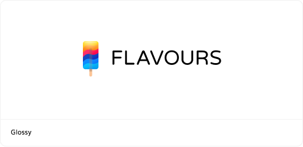</a></td>
<td><strong>Glossy</strong>   <a href="./assets/GlossyReversed.svg">SVG</a> <a href="./assets/GlossyReversed.png">PNG</a></td>
<td><a target="_blank" rel="noopener noreferrer" href="./previews/GlossyReversed.png">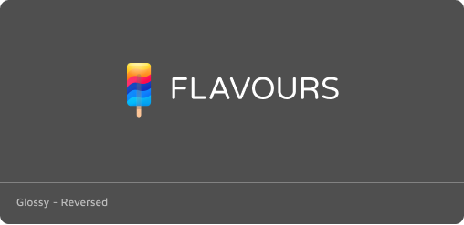</a></td>
</tr>
<tr>
<td><strong>Flat</strong>  <a href="./assets/Flat.svg">SVG</a> <a href="./assets/Flat.png">PNG</a></td>
<td><a target="_blank" rel="noopener noreferrer" href="./previews/Flat.png">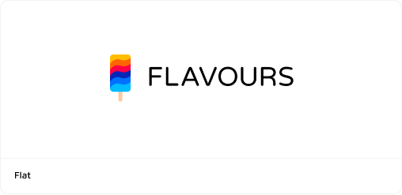</a></td>
<td><strong>Flat</strong>  <a href="./assets/FlatReversed.svg">SVG</a> <a href="./assets/FlatReversed.png">PNG</a></td>
<td><a target="_blank" rel="noopener noreferrer" href="./previews/FlatReversed.png">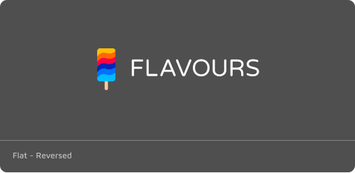</a></td>
</tr>
<tr>
<td><strong>One Color</strong>  <a href="./assets/OneColor.svg">SVG</a> <a href="./assets/OneColor.png">PNG</a></td>
<td></td>
<td><strong>One Color</strong>  <a href="./assets/OneColorReversed.svg">SVG</a> <a href="./assets/OneColorReversed.png">PNG</a></td>
<td><a target="_blank" rel="noopener noreferrer" href="./previews/OneColorReversed.png">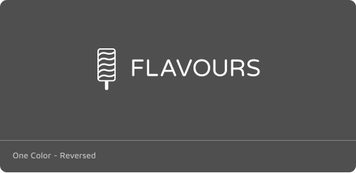</a></td>
</tr>
</tbody>
</table>

## Icon

<table>
<tbody>
<tr>
<td><strong>Node</strong>  <a href="./assets/IconNode.svg">SVG</a> <a href="./assets/IconNode.png">PNG</a></td>
<td><a target="_blank" rel="noopener noreferrer" href="./previews/IconNode.png">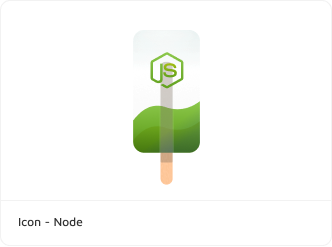</a></td>
<td><strong>Python</strong>  <a href="./assets/IconPython.svg">SVG</a> <a href="./assets/IconPython.png">PNG</a></td>
<td><a target="_blank" rel="noopener noreferrer" href="./previews/IconPython.png">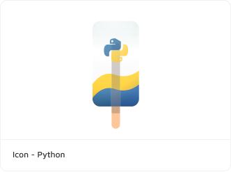</a></td>
<td><strong>PHP</strong>  <a href="./assets/IconPHP.svg">SVG</a> <a href="./assets/IconPHP.png">PNG</a></td>
<td></td>
</tr>
<tr>
<td><strong>Go</strong>  <a href="./assets/IconGo.svg">SVG</a> <a href="./assets/IconGo.png">PNG</a></td>
<td></td>
<td><strong>.net core</strong>  <a href="./assets/IconNET.svg">SVG</a> <a href="./assets/IconNET.png">PNG</a></td>
<td><a target="_blank" rel="noopener noreferrer" href="./previews/IconNET.png">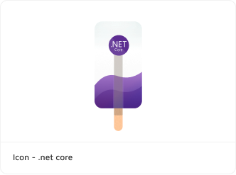</a></td>
<td><strong>Aldryn</strong>  <a href="./assets/IconAldryn.svg">SVG</a> <a href="./assets/IconAldryn.png">PNG</a></td>
<td><a target="_blank" rel="noopener noreferrer" href="./previews/IconAldryn.png">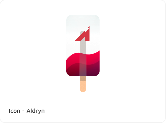</a></td>
</tr>
</tbody>
</table>

## Flavours

<table>
<tbody>
<tr>
<td><strong>Icon Glossy</strong>  <a href="./assets/IconGlossy.svg">SVG</a> <a href="./assets/IconGlossy.png">PNG</a></td>
<td><a target="_blank" rel="noopener noreferrer" href="./previews/IconGlossy.png">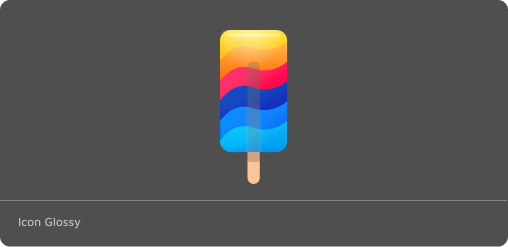</a></td>
<td><strong>Icon Black</strong>  <a href="./assets/IconBlack.svg">SVG</a> <a href="./assets/IconBlack.png">PNG</a></td>
<td></td>
</tr>
<tr>
<td><strong>Icon Flat</strong>  <a href="./assets/IconFlat.svg">SVG</a> <a href="./assets/IconFlat.png">PNG</a></td>
<td><a target="_blank" rel="noopener noreferrer" href="./previews/IconFlat.png">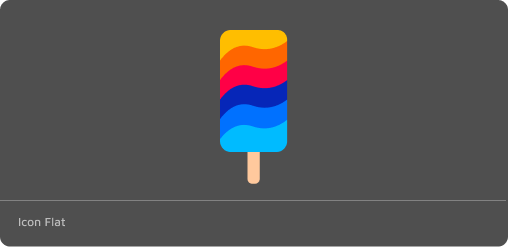</a></td>
<td><strong>Icon White</strong>  <a href="./assets/IconWhite.svg">SVG</a> <a href="./assets/IconWhite.png">PNG</a></td>
<td></td>
</tr>
</tbody>
</table>

## Colors

<table>
<tbody>
<tr>
<td><strong>#FFBE00</strong></td>
<td><a target="_blank" rel="noopener noreferrer" href="./previews/ColourYellow.png">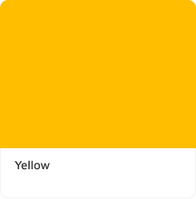</a></td>
<td><strong>#0071FF</strong></td>
<td></td>
<td><strong>#FF0046</strong></td>
<td><a target="_blank" rel="noopener noreferrer" href="./previews/ColourRed.png">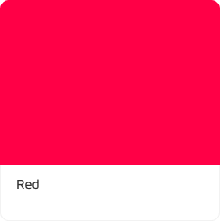</a></td>
</tr>
<tr>
<td><strong>##00BBFF</strong></td>
<td><a target="_blank" rel="noopener noreferrer" href="./previews/ColourLightBlue.png">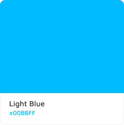</a></td>
<td><strong>#0071FF</strong></td>
<td><a target="_blank" rel="noopener noreferrer" href="./previews/ColourBlue.png">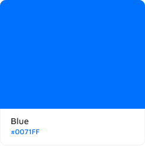</a></td>
<td><strong>#0626B8</strong></td>
<td><a target="_blank" rel="noopener noreferrer" href="./previews/ColourDarkBlue.png">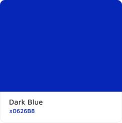</a>.</td>
</tr>
</tbody>
</table>
