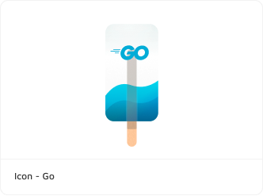

# Mediakit

Welcome to Flavours media kit! Feel free to download our brand assets. A lot of work went into them, so we appreciate if you leave them unchanged and looking forward to seeing them all over the web. Need another asset? [Please let us know](ailto:support@divio.com).

## Primary Logo

Our horizontal logo is the primary logo. This is the preferred logo to use in content.

| Standard                                                                    |                                       | Reversed                                                                                    |                                                          |
| --------------------------------------------------------------------------- | ------------------------------------- | ------------------------------------------------------------------------------------------- | -------------------------------------------------------- |
| **Glossy**   [SVG](./assets/Glossy.svg) [PNG](./assets/Glossy.png)       |       | **Glossy**   [SVG](./assets/GlossyReversed.svg) [PNG](./assets/GlossyReversed.png)       |       |
| **Flat**  [SVG](./assets/Flat.svg) [PNG](./assets/Flat.png)              |           | **Flat**  [SVG](./assets/FlatReversed.svg) [PNG](./assets/FlatReversed.png)              |           |
| **One Color**  [SVG](./assets/OneColor.svg) [PNG](./assets/OneColor.png) |  | **One Color**  [SVG](./assets/OneColorReversed.svg) [PNG](./assets/OneColorReversed.png) |  |

## Icon

| Colour                                                                            |                                           | Black & White                                                                  |                                         |
| --------------------------------------------------------------------------------- | ----------------------------------------- | ------------------------------------------------------------------------------ | --------------------------------------- |
| **Icon Glossy**  [SVG](./assets/IconGlossy.svg) [PNG](./assets/IconGlossy.png) |  | **Icon Black**  [SVG](./assets/IconBlack.svg) [PNG](./assets/IconBlack.png) |  |
| **Icon Flat**  [SVG](./assets/IconFlat.svg) [PNG](./assets/IconFlat.png)       |      | **Icon White**  [SVG](./assets/IconWhite.svg) [PNG](./assets/IconWhite.png) |  |

## Flavours

|                                                                        |                                         |                                                                              |                                              |                                                                              |                                             |
| ---------------------------------------------------------------------- | --------------------------------------- | ---------------------------------------------------------------------------- | -------------------------------------------- | ---------------------------------------------------------------------------- | ------------------------------------------- |
| **Node**  [SVG](./assets/IconNode.svg) [PNG](./assets/IconNode.png) |  | **Python**  [SVG](./assets/IconPython.svg) [PNG](./assets/IconPython.png) |   | **PHP**  [SVG](./assets/IconPHP.svg) [PNG](./assets/IconPHP.png)          |       |
| **Go**  [SVG](./assets/IconGo.svg) [PNG](./assets/IconGo.png)         |        | **.net core**  [SVG](./assets/IconNET.svg) [PNG](./assets/IconNET.png)    |  | **Aldryn**  [SVG](./assets/IconAldryn.svg) [PNG](./assets/IconAldryn.png) |  |

## Colors

|              |                                                        |              |                                                        |              |                                                        |
| ------------ | ------------------------------------------------------ | ------------ | ------------------------------------------------------ | ------------ | ------------------------------------------------------ |
| **#FFBE00**  |         | **#0071FF**  |         | **#FF0046**  |               |
| **##00BBFF** |  | **#0071FF**  |             | **#0626B8**  | .  |
